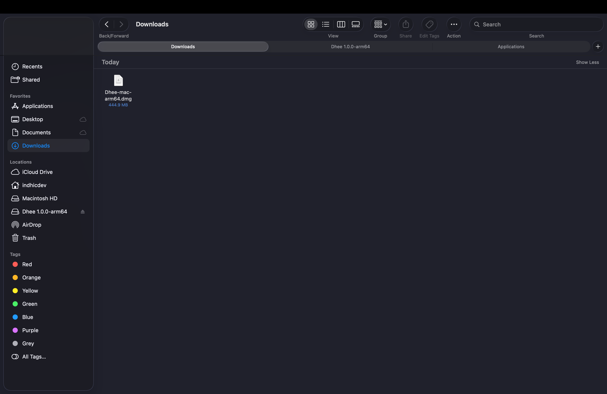
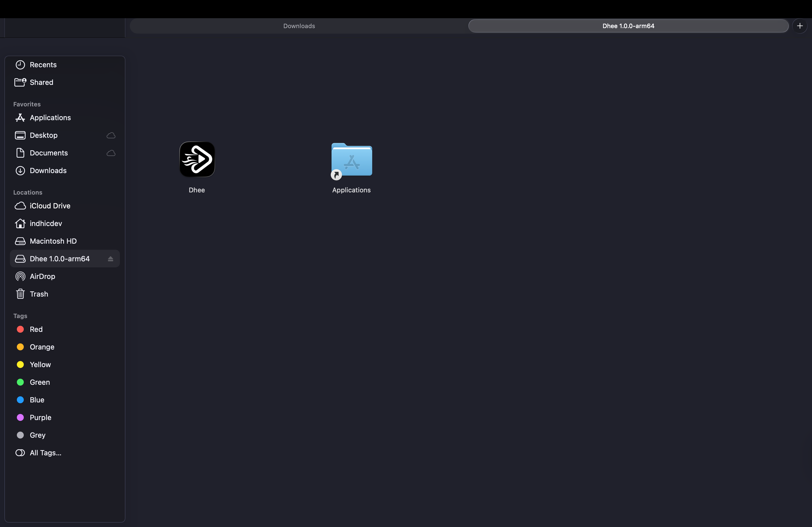
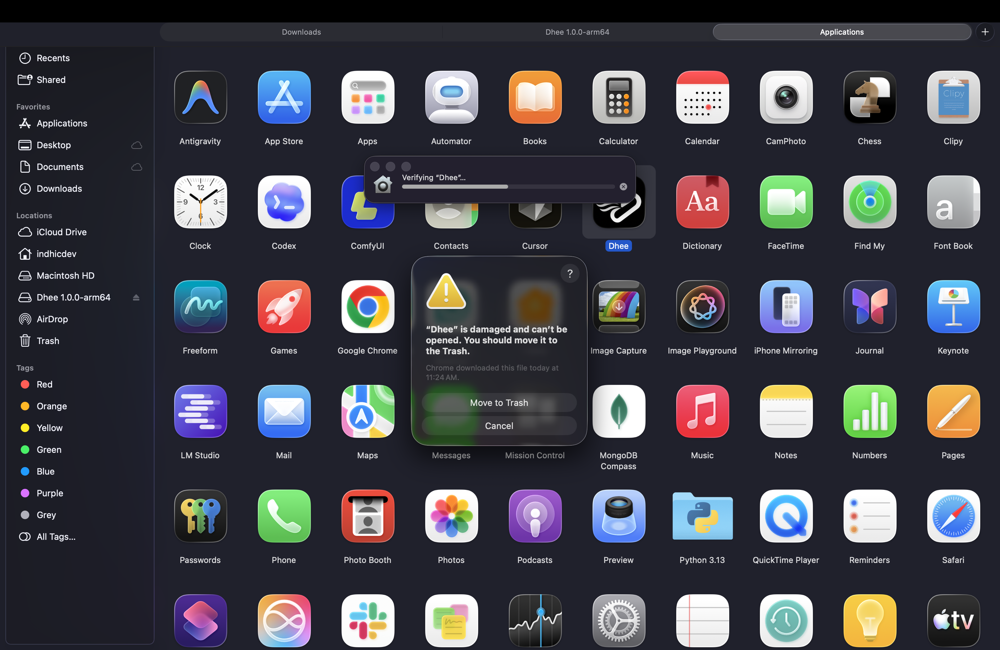
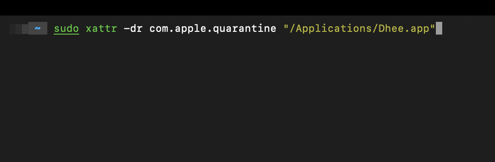
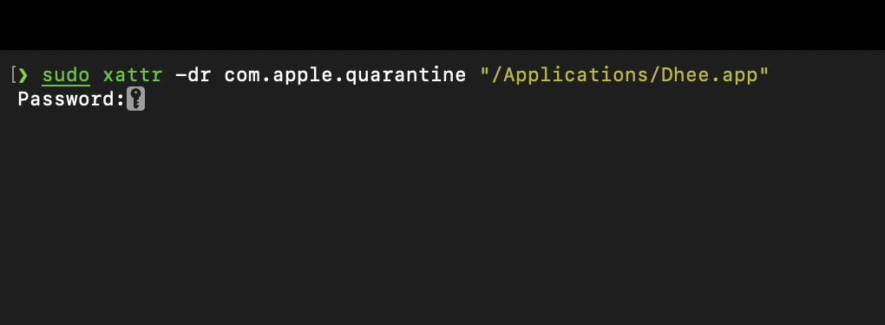

# Dhee Studio

Dhee Studio is available for Windows and macOS from the official website:

[Download Dhee Studio](https://dhee.studio/)

## Installation Guides

Open the guide for your operating system:

<details open>
<summary><strong>Windows Installation</strong></summary>

## Windows Installation

The current Windows installer is not code-signed yet. Because of that, Microsoft Defender SmartScreen may show an "Unknown publisher" warning before installation. If you downloaded Dhee Studio from the official website, follow the steps below to continue.

### 1. Open the downloaded installer

After downloading Dhee Studio, open File Explorer, go to your Downloads folder, and double-click the `Dhee-windows-x64-setup` application.


### 2. Open SmartScreen details

If Windows shows "Windows protected your PC", click **More info**.


### 3. Run the installer

After the details appear, confirm that the app is `Dhee-windows-x64-setup.exe`, then click **Run anyway**.


### 4. Choose who can use Dhee Studio

Choose the installation scope:

- **Only for me**: recommended for most users. This installs Dhee Studio for your Windows account.
- **Anyone who uses this computer**: use this only if you want all Windows users on the computer to access Dhee Studio.

Click **Next**.


### 5. Install Dhee Studio

Keep the default install location unless you need to choose a different folder, then click **Install**.


### 6. Launch Dhee Studio

When installation is complete, launch Dhee Studio from the Windows Start menu or from the installed shortcut.


</details>

<details>
<summary><strong>macOS Installation</strong></summary>

## macOS Installation

The current macOS app is not notarized yet. Because of that, macOS may block the app or show a warning such as "`Dhee` is damaged and can't be opened." If you downloaded Dhee Studio from the official website, follow the steps below to install it and remove the quarantine flag.

### 1. Open the downloaded DMG

After downloading Dhee Studio, open Finder, go to your Downloads folder, and double-click the `Dhee-0.1.0-arm64.dmg` file.



### 2. Move Dhee to Applications

Drag the **Dhee** app icon into the **Applications** folder.



> **Note:** If you try to open Dhee before running the terminal command below, macOS may show a warning that "`Dhee` is damaged and can't be opened." Do not move it to Trash. Continue with the next steps.



### 3. Open Terminal

Open the macOS Terminal app and enter this command:

```bash
sudo xattr -dr com.apple.quarantine "/Applications/Dhee.app"
```



### 4. Enter your Mac password

Press **Return**. Terminal may ask for your Mac password. Type your password and press **Return** again.

Terminal does not show password characters while you type. This is normal.



### 5. Launch Dhee Studio

After the command finishes, open Dhee from the Applications folder.


</details>
