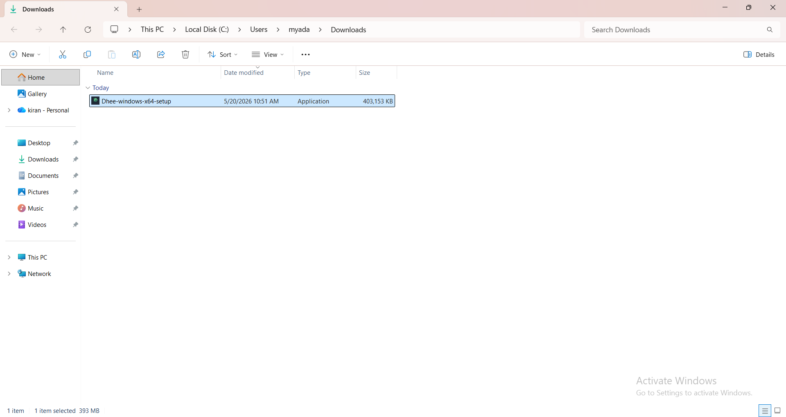
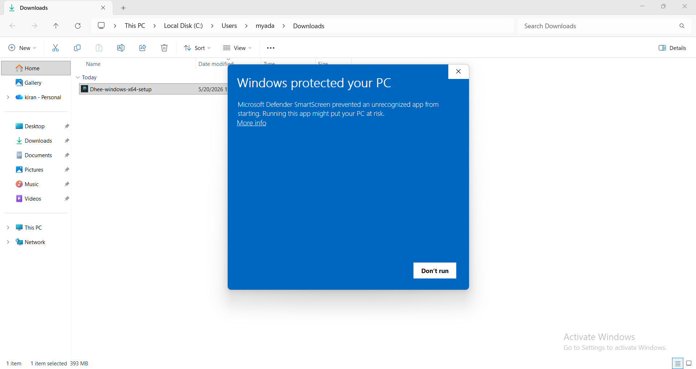
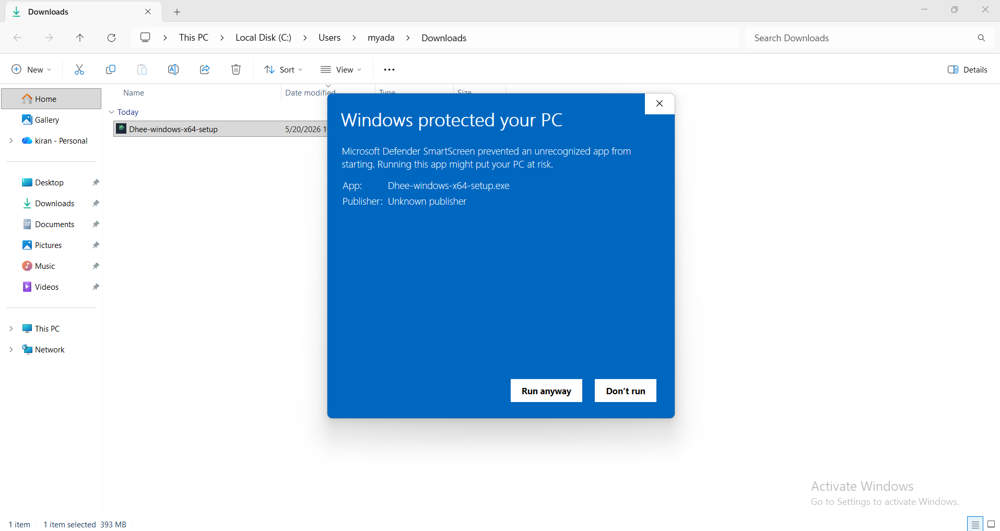
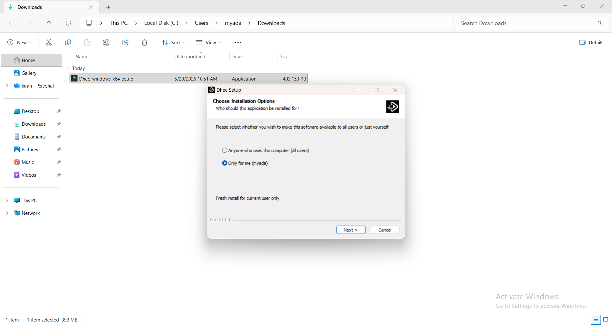
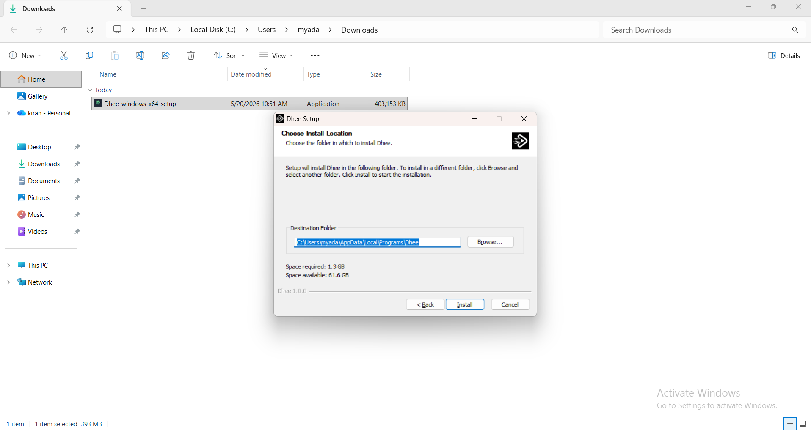
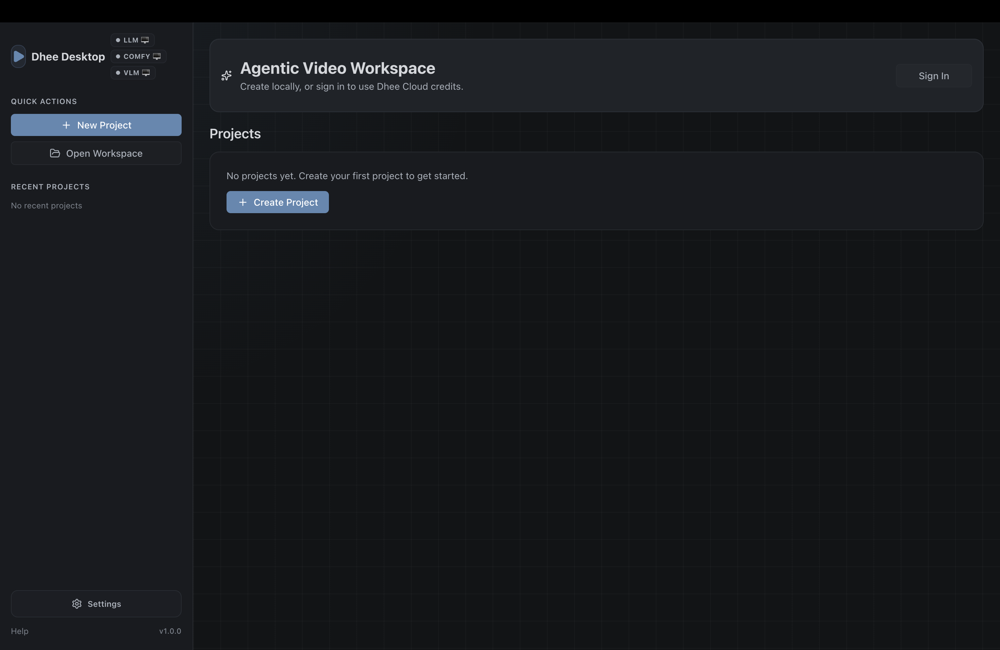

# Dhee Studio Windows Installation

The current Windows installer is not code-signed yet. Because of that, Microsoft Defender SmartScreen may show an "Unknown publisher" warning before installation. If you downloaded Dhee Studio from the official website, follow the steps below to continue.

[Download Dhee Studio](https://dhee.studio/)

## 1. Open the downloaded installer

After downloading Dhee Studio, open File Explorer, go to your Downloads folder, and double-click the `Dhee-windows-x64-setup` application.

## 2. Open SmartScreen details

If Windows shows "Windows protected your PC", click **More info**.

## 3. Run the installer

After the details appear, confirm that the app is `Dhee-windows-x64-setup.exe`, then click **Run anyway**.

## 4. Choose who can use Dhee Studio

Choose the installation scope:

- **Only for me**: recommended for most users. This installs Dhee Studio for your Windows account.
- **Anyone who uses this computer**: use this only if you want all Windows users on the computer to access Dhee Studio.

Click **Next**.

## 5. Install Dhee Studio

Keep the default install location unless you need to choose a different folder, then click **Install**.

## 6. Launch Dhee Studio

When installation is complete, launch Dhee Studio from the Windows Start menu or from the installed shortcut.

